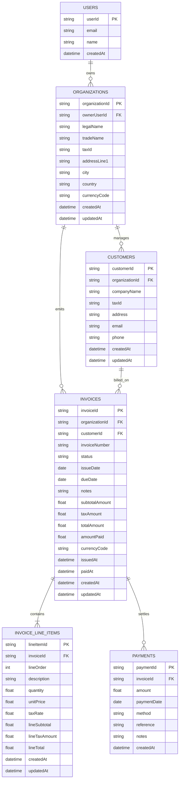

# Billkerfy Database Model (Appwrite)

This model is aligned with the current UI flow in `CreateInvoicePage` and supports draft, issue, and mark-as-paid actions.

## Mermaid ER Diagram

## Appwrite Collections

Database ID suggestion: `billkerfy`.

1. `organizations`
- `ownerUserId` (string, required)
- `legalName` (string, required)
- `tradeName` (string)
- `taxId` (string, required)
- `addressLine1` (string, required)
- `city` (string, required)
- `country` (string, required)
- `currencyCode` (string, required, default `EUR`)

Indexes:
- unique: `taxId` scoped by `ownerUserId` (or composite index if available)
- key: `ownerUserId`

2. `customers`
- `organizationId` (string, required)
- `companyName` (string, required)
- `taxId` (string)
- `address` (string, required)
- `email` (string)
- `phone` (string)

Indexes:
- key: `organizationId`
- key: `companyName`
- unique: `organizationId + taxId` (recommended when `taxId` is present)

3. `invoices`
- `organizationId` (string, required)
- `customerId` (string, required)
- `invoiceNumber` (string, required)
- `status` (enum string: `draft | issued | paid | void`, required)
- `issueDate` (datetime, required)
- `dueDate` (datetime, required)
- `notes` (string)
- `subtotalAmount` (double, required)
- `taxAmount` (double, required)
- `totalAmount` (double, required)
- `amountPaid` (double, required, default `0`)
- `currencyCode` (string, required, default `EUR`)
- `issuedAt` (datetime)
- `paidAt` (datetime)

Indexes:
- key: `organizationId`
- key: `customerId`
- key: `status`
- unique: `organizationId + invoiceNumber`

4. `invoiceLineItems`
- `invoiceId` (string, required)
- `lineOrder` (integer, required)
- `description` (string, required)
- `quantity` (double, required)
- `unitPrice` (double, required)
- `taxRate` (double, required)
- `lineSubtotal` (double, required)
- `lineTaxAmount` (double, required)
- `lineTotal` (double, required)

Indexes:
- key: `invoiceId`
- unique: `invoiceId + lineOrder`

5. `payments`
- `invoiceId` (string, required)
- `amount` (double, required)
- `paymentDate` (datetime, required)
- `method` (enum string: `bank_transfer | card | cash | other`, required)
- `reference` (string)
- `notes` (string)

Indexes:
- key: `invoiceId`
- key: `paymentDate`

## State Transitions

1. `draft -> issued`
- set `status=issued`
- set `issuedAt=now`

2. `issued -> paid`
- create one or more `payments`
- update `amountPaid`
- when `amountPaid >= totalAmount`, set `status=paid` and `paidAt=now`

## Query Patterns

1. Invoice list screen:
- filter by `organizationId`
- optional filters: `status`, `customerId`, date range by `issueDate`

2. Create/Edit invoice:
- read `customers` by `organizationId`
- create/update `invoices`
- replace `invoiceLineItems` for that `invoiceId` in a single save flow

3. Mark as paid:
- append `payments`
- recompute `amountPaid` and invoice status
